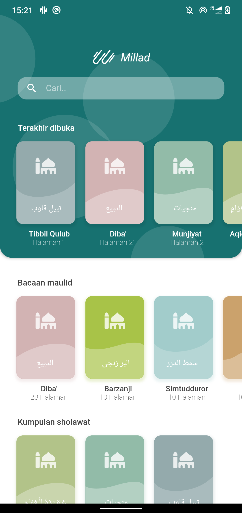
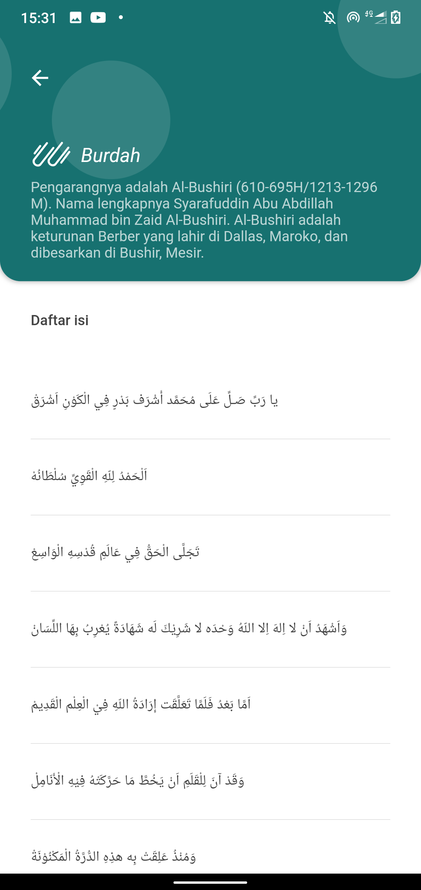
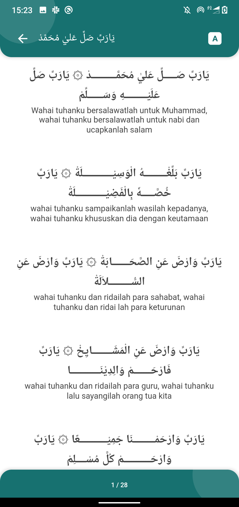

# millad

Collection of Islamic "Milad / Maulid / Sholawat" Prophet Book.

<!--  -->


## Getting Started

This project is using Flutter. For help getting started with Flutter, view our [online documentation](https://flutter.dev/docs).


## How to Contribute

To add more books or sholawat, please raise a PR by following below instruction:
1. Add your books title and description in `/lib/storage/book.dart`. You can put your book either in `maulidBoooks` or `otherBooks` list.
2. In assets (`/assets/books/`), please create folder which following this structure:
```bash 
## Let say we add new book called `burdah`
.
assets/
|-- books/
|   |-- burdah/
|   |   |-- content.json
|   |   |-- web1.html
|   |   |-- web2.html
```

`content.json` Is contains an json array which explain the content structure looks like, you should put `title` and `content_uri` in as the key. example:
```json
[
  {
    "title": "يا رَبِّ صَـلِّ عَلَى مُحَمَّد أَشْرَف بَدْرٍ فِي الْكَوْنِ اَشْرَقْ",
    "content_uri": "assets/books/burdah/web1.html"
  },
  {
    "title": "اَلْحَمْدُ لِلّهِ الْقَوِيِّ سُلْطَانُهْ",
    "content_uri": "assets/books/burdah/web2.html"
  }
]
```

Basically, your `json` file will be converted into `table of content` like this:




for each content file (`web1.html`) It will displayed on the App for each the table of content clicked. 
Its basically a free html string. Currently we support two class for font style default:
- `arab`: will be in arabic font as main read, and bold.
- `translate`: will be act as translation for each arabic text. This class will be hide the content if user disabled a translation tag (There is a button in each app)

example:
```html
<div>
	<p>
		<span class="arab">يَارَبِّ صَـــــلِّ عَليٰ مُحَمَّــــــــــدْ ۞ يَارَبِّ صَلِّ عَلَيْـــــــــهِ وَسَــــــلِّمْ</span><br/>
		<span class="translate">Wahai tuhanku bersalawatlah untuk Muhammad, wahai tuhanku bersalawatlah untuk nabi dan ucapkanlah salam</span>
	</p>
	<p>
		<span class="arab">يَارَبِّ بَلِّغْـــــــــهُ الْوَسِيْــــــــــــلَةْ ۞ يَارَبِّ خُصَّـــــهٗ بِالْفَضِيْــــــــــــلَةْ</span><br/>
		<span class="translate">wahai tuhanku sampaikanlah wasilah kepadanya, wahai tuhanku khususkan dia dengan keutamaan</span>
	</p>
	<p>
		<span class="arab">يَارَبِّ وَارْضَ عَنِ الصَّحَـــــــابَةْ ۞ يَارَبِّ وَارْضَ عَنِ السُّـــــــــلاَلَةْ</span><br/>
		<span class="translate">wahai tuhanku dan ridailah para sahabat, wahai tuhanku dan ridai lah para keturunan</span>
	</p>
	<p>
		<span class="arab">يَارَبِّ وَارْضَ عَنِ الْمَشَــــــــايِخْ ۞ يَارَبِّ فَارْحَـــــــمْ وَالِدِيْنَــــــــــــا</span><br/>
		<span class="translate">wahai tuhanku dan ridailah para guru, wahai tuhanku lalu sayangilah orang tua kita</span>
	</p>
	<p>
		<span class="arab">يَارَبِّ وَارْحَمْـــــــــنَا جَمِيْـــــــــــعًا ۞ يَارَبِّ وَارْحَـــــــــــمْ كُلَّ مُسْــــلِمْ</span><br/>
		<span class="translate">wahai tuhanku dan sayangilah kita semua, wahai tuhanku dan sangilah setiap muslim</span>
	</p>
</div>
```
With magic, your html above will be rendered like this on the app:


<br/><br/>

3. Last, register your folder inside the `pubspec.yaml`
```yaml
flutter:

  # The following line ensures that the Material Icons font is
  # included with your application, so that you can use the icons in
  # the material Icons class.
  uses-material-design: true

  # To add assets to your application, add an assets section, like this:
  assets:
    - assets/images/
    - assets/books/burdah/
```

Violla. your book will be available in the app on the next release :) <br/>
You can also fix the arabic text or the translation one if you find anything missed.

Lets make this better.